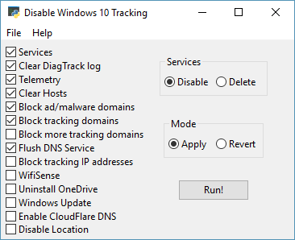

# DisableWinTracking

A tool that I created to use some of the known methods of disabling tracking and implement adblocking in Windows 10.



## CYRILLIC LANGUAGES WARNING

## ПРЕДУПРЕЖДЕНИЕ ДЛЯ КИРИЛЛИЧЕСКИХ ЯЗЫКОВ

**Slavic languages: Belarusian, Bulgarian, Macedonian, Russian, Rusyn, Serbo-Croatian (for Standard Serbian, Bosnian, and Montenegrin), Ukrainian.**

**Славянские языки: белорусский, болгарский, македонский, русский, русинский, сербохорватский (для стандартного сербского, боснийского и черногорского), украинский.**

This program cannot run correctly from a file path that contains Cyrillic characters. Make sure to run it from your root folder (usually C:/ ) so that you don't get runtime errors.

Эта программа не может работать корректно, если в пути к файлу есть кириллические символы. Обязательно запустите его из корневой папки ( обычно C:/ ), чтобы вы не получали ошибок во время выполнения.

## DOWNLOAD

[DOWNLOAD EXE HERE](https://github.com/LukaszLapaj/DisableWinTracking/blob/master/dwt.exe?raw=true)

**Note:** Windows Defender may report the EXE as a trojan (Win32/Pocyx.C!cl), and may therefore prevent you from extracting the EXE to anywhere on your computer. Set up an exclusion in **Settings > Update & Security > Windows Defender > Exclusions** by adding the folder you intend to extract the EXE to.

## How to Use

You can either:

A. [Run the binary uploaded to the repo as an Administrator and select which options you'd like](https://github.com/LukaszLapaj/DisableWinTracking/blob/master/dwt.exe?raw=true)

B. Install Python and the dependencies listed below and run the script from an elevated command prompt and select which options you'd like  

#### Silent

Either can be run with the -silent argument as of v3.1. This will perform all available options of the version you're using.

**You still need to run it as administrator.**

## Dependencies
This is only to run the script from source, [download the exe here](https://github.com/LukaszLapaj/DisableWinTracking/blob/master/dwt.exe?raw=true)
* Tested on Python 3.6
* [wxPython](http://wxpython.org/download.php) -- GUI (Tested with wxPython=Phoenix)
* [PyWin32](http://sourceforge.net/projects/pywin32/files/pywin32/)
* Windows 10 (Duh)

## Methods Used

#### Telemetry

Set the `AllowTelemetry` string in `HKEY_LOCAL_MACHINE\SOFTWARE\Policies\Microsoft\Windows\DataCollection` to `0`

#### DiagTrack Log

Clears and disables writing to the log located in `C:\ProgramData\Microsoft\Diagnosis\ETLLogs\AutoLogger`

#### Services

You can delete or disable the 2 services below:
* `DiagTrack` Diagnostics Tracking Service
* `dmwappushsvc` WAP Push Message Routing Service

Action:
* Delete: Remove both services
* Disable: Set the `Start` registry key for both services to `4` (Disabled) Located at `HKEY_LOCAL_MACHINE\SYSTEM\CurrentControlSet\Services\`

#### HOSTS

Append known tracking and ad domains to the `HOSTS` file located in `C:\Windows\System32\drivers\etc`

#### IP Blocking

Blocks known tracking IPs with the Windows Firewall. The rules are named TrackingIPX, replacing X with the IP numbers.

#### WifiSense
Disables the following:
- Credential Share
- Open-ness

#### OneDrive

Runs `C:\Windows\SysWOW64\OneDriveSetup.exe /uninstall` (64 bit) or  
`C:\Windows\System32\OneDriveSetup.exe /uninstall` (32 bit)

Also disables registry entries that keep the OneDrive Icon pinned to your Windows Explorer list:


## Delete Services vs Disable Services?

Selecting "Disable" will simply stop the services from being able to run.
Selecting the "Delete" choice will completely delete the tracking services.

## License

```
Copyright (C) 10se1ucgo 2016
Copyright (C) Łukasz Łapaj 2018

This program is free software: you can redistribute it and/or modify
it under the terms of the GNU General Public License as published by
the Free Software Foundation, either version 3 of the License, or
(at your option) any later version.

This program is distributed in the hope that it will be useful,
but WITHOUT ANY WARRANTY; without even the implied warranty of
MERCHANTABILITY or FITNESS FOR A PARTICULAR PURPOSE.  See the
GNU General Public License for more details.

You should have received a copy of the GNU General Public License
along with this program.  If not, see <http://www.gnu.org/licenses/>.
```
